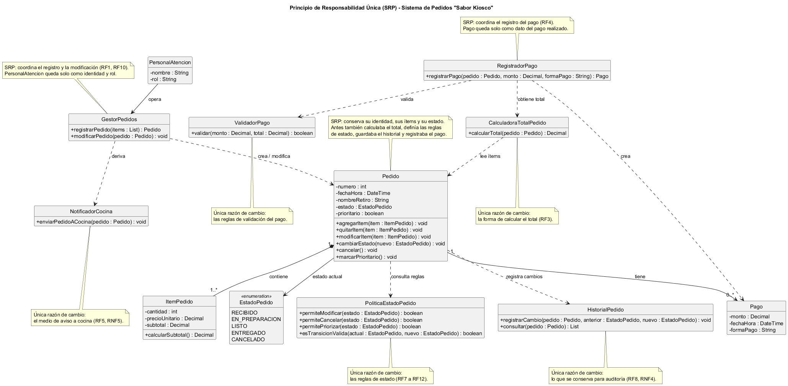

# Principio de Responsabilidad Única (SRP)

## Propósito y Tipo del Principio SOLID

El Principio de Responsabilidad Única (*Single Responsibility Principle*) es el primero de los principios SOLID y es un principio de diseño de clases orientado a la cohesión. Establece que una clase debe tener una única razón para cambiar, es decir, debe responder a un solo tipo de decisión del negocio.

El problema que resuelve es la acumulación de tareas distintas en una misma clase. Cuando una clase calcula importes, valida reglas, guarda registros y coordina a otros objetos, cualquier cambio en una de esas tareas obliga a modificarla y pone en riesgo a las demás. El SRP lo soluciona separando cada responsabilidad en una clase propia, de modo que un cambio en una regla del negocio afecte a una sola clase.

## Motivación

El análisis se hizo sobre el [boceto inicial de clases](../../diagramas/01-diagrama-clases/01-boceto-inicial-corregido.excalidraw), las [tarjetas CRC](../../herramientas-agile/tarjetas-crc/tarjetas-crc.md) y los requisitos de [introduccion.md](../introduccion.md). Se identificaron tres clases principales con más de una responsabilidad.

| Clase del boceto | Responsabilidades que mezcla | Problema de mantenibilidad |
| :--- | :--- | :--- |
| `Pedido` | Administra sus ítems (`agregarItem()`, `quitarItem()`, `modificarItem()`), calcula el total (`calcularTotal()`), decide qué transiciones de estado son válidas (`cambiarEstado()`, `cancelar()`), conserva el historial y registra el pago (`registrarPago()`). | Tiene cinco razones para cambiar. Un cambio en la forma de calcular el total, en las reglas de estado, en lo que se guarda para auditoría o en el cobro obliga a modificar la clase central del sistema. |
| `Pago` | Guarda los datos del pago (`monto`, `fechaHora`, `formaPago`), valida que el importe sea coherente con el total del pedido y ejecuta el registro (`registrarPago()`). | El método `registrarPago()` está duplicado en `Pedido` y en `Pago`, por lo que no queda claro quién es responsable del cobro. Una regla de validación nueva obliga a tocar la clase que representa el dato. |
| `PersonalAtencion` | Representa a quien atiende (`nombre`, `rol`), coordina el alta y la modificación de pedidos (`registrarPedido()`, `modificarPedido()`) y comunica el pedido a cocina (`enviarPedidoACocina()`). | Mezcla la identidad de una persona con la lógica de los casos de uso y con el medio de comunicación. Cambiar la forma de avisar a cocina obliga a modificar la clase que describe al personal. |

### Ejemplo del proyecto

El RNF8 pide que el diseño permita incorporar el cobro por QR y un programa de puntos sin reestructurar las entidades base. Con el boceto inicial, ambos cambios recaen sobre `Pedido`:

- El programa de puntos modifica el cálculo del total, que está en `Pedido.calcularTotal()`.
- El cobro por QR modifica el registro del pago, que está en `Pedido.registrarPago()` y en `Pago.registrarPago()`.

`Pedido` también contiene las reglas de estado que definen cuándo se puede modificar o cancelar un pedido (RF8 y RF10 a RF12). Dos cambios que no tienen relación con esas reglas terminan editando la misma clase, y un error en el cálculo de puntos puede dejar sin funcionar la cancelación de pedidos. Al aplicar el SRP, el programa de puntos solo modifica `CalculadoraTotalPedido` y el cobro por QR solo modifica `RegistradorPago` y `ValidadorPago`; `Pedido` no cambia.

## Estructura de Clases

El diagrama muestra la refactorización propuesta para las tres clases analizadas. Las notas indican la responsabilidad única de cada clase y el requisito que determina su razón de cambio.

- [Ver el diagrama en detalle (PNG)](../../diagramas/01-diagrama-clases/01-solid-01-srp.png)
- [Ver el código PlantUML](../../diagramas/01-diagrama-clases/01-solid-01-srp.puml)

## Justificación Técnica

### Pedido

`Pedido` conserva su identidad (`numero`, `nombreRetiro`), su composición de `ItemPedido`, su `estado` y su condición de `prioritario`. De sus cinco responsabilidades originales se extraen cuatro: tres pasan a clases nuevas y el registro del pago pasa a `RegistradorPago`, que se describe en la sección siguiente.

| Clase resultante | Responsabilidad única | Razón para cambiar |
| :--- | :--- | :--- |
| `Pedido` | Mantener sus ítems y su estado actual. | Cambia la estructura del pedido. |
| `PoliticaEstadoPedido` | Decidir si un estado permite modificar, cancelar o priorizar, y si una transición es válida. | Cambian las reglas de estado (RF7 a RF12). |
| `CalculadoraTotalPedido` | Calcular el total a partir de los ítems. | Cambia la forma de calcular el total (RF3). |
| `HistorialPedido` | Registrar y consultar los cambios de estado de un pedido. | Cambia lo que se conserva para auditoría (RF8, RNF4). |

En el diagrama, `Pedido` depende de `PoliticaEstadoPedido` y de `HistorialPedido` mediante relaciones de dependencia (línea punteada): las usa, pero no contiene su lógica. La relación de composición con `ItemPedido` se mantiene igual que en el boceto.

Esta separación respeta el RNF7, que exige que las transiciones de estado queden encapsuladas en las entidades del dominio. `cambiarEstado()` y `cancelar()` siguen siendo los únicos puntos de entrada para modificar el estado y permanecen en `Pedido`; lo que se extrae es la definición de la regla, no el control del estado. Ningún objeto externo puede cambiar el estado sin pasar por `Pedido`. Los actores del boceto que no se refactorizaron (`Cocina`, `Encargado` y `Cliente`) siguen solicitando los cambios de estado a través de esos métodos.

`Pedido` incorpora la operación `marcarPrioritario()`, que no figuraba en el boceto. El RF9 pide marcar un pedido como prioritario y la tarjeta CRC de `Pedido` le asigna mantener su condición de prioridad, pero el boceto solo tenía el atributo `prioritario`. La operación consulta `permitePriorizar()` de `PoliticaEstadoPedido`, porque la prioridad solo se admite en estado recibido o en preparación.

`CalculadoraTotalPedido` depende de `Pedido` y no al revés: lee los ítems y devuelve el importe. Por eso `Pedido` deja de tener un método `calcularTotal()`.

### Pago

| Clase resultante | Responsabilidad única | Razón para cambiar |
| :--- | :--- | :--- |
| `Pago` | Representar un pago realizado: monto, fecha y forma de pago. | Cambian los datos que se guardan de un pago. |
| `ValidadorPago` | Verificar que un pago sea coherente con el total del pedido. | Cambian las reglas de validación del pago. |
| `RegistradorPago` | Coordinar el registro: obtiene el total, valida y crea el `Pago`. | Cambia el procedimiento de cobro (RF4). |

`Pago` queda sin métodos de negocio y mantiene la asociación "tiene" con `Pedido` que ya existía en el boceto. El método `registrarPago()`, que estaba duplicado, pasa a existir una sola vez en `RegistradorPago`. Esta clase depende de `CalculadoraTotalPedido` para obtener el importe, de `ValidadorPago` para comprobarlo y de `Pago` para crear el registro. `ValidadorPago` recibe el monto y el total, no un `Pago`, porque la validación ocurre antes de que el pago exista: solo se crea el `Pago` si el monto es válido.

### PersonalAtencion

| Clase resultante | Responsabilidad única | Razón para cambiar |
| :--- | :--- | :--- |
| `PersonalAtencion` | Representar a la persona que atiende: nombre y rol. | Cambian los datos del personal. |
| `GestorPedidos` | Coordinar el alta y la modificación de pedidos. | Cambian los pasos de esos casos de uso (RF1, RF10). |
| `NotificadorCocina` | Enviar el pedido a cocina. | Cambia el medio de comunicación con cocina (RF5, RNF5). |

`PersonalAtencion` se asocia con `GestorPedidos`, que es quien crea y modifica el `Pedido` y deriva el aviso a `NotificadorCocina`. La identidad de quien opera queda separada de la lógica de los casos de uso.

### Por qué la solución es correcta

- Cada clase resultante tiene una sola razón para cambiar, identificada con un requisito concreto del sistema. Ninguna quedó con una responsabilidad compartida.
- La descomposición no agrega conceptos ajenos al dominio: las clases nuevas nombran tareas que ya figuraban como métodos del boceto o como responsabilidades de las tarjetas CRC.
- Las clases que ya eran cohesivas no se modificaron. `ItemPedido` solo calcula su subtotal, `Producto` solo informa su precio y `Personalizacion` solo calcula su adicional.
- El costo es un mayor número de clases: las tres clases analizadas pasan a ser diez, más la enumeración `EstadoPedido`. Se considera aceptable porque cada una es pequeña y puede modificarse sin afectar al resto.
