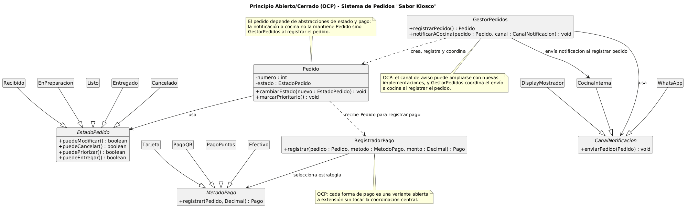

# Principio Abierto/Cerrado (OCP)

## Propósito y Tipo del Principio SOLID

El Principio Abierto/Cerrado (*Open/Closed Principle* o OCP) establece que una clase debe estar abierta a la extensión, pero cerrada a la modificación. En otras palabras, el comportamiento de una entidad del dominio puede ampliarse con nuevas variantes sin tocar el código ya existente ni romper el comportamiento actual del sistema.

Este principio es clave en el diseño orientado a objetos porque el negocio del kiosco no es estático: puede crecer con nuevos estados del pedido, nuevos medios de pago, nuevas formas de notificación o políticas de cálculo. Si la lógica de decisión está mezclada dentro de una clase central, un cambio de negocio obliga a reescribir la misma clase y aumenta el riesgo de errores en otras funcionalidades.

En este sistema, la extensión se aplica principalmente a la evolución del ciclo de vida del pedido, de las formas de pago y de la comunicación con cocina. El diseño propuesto evita que `Pedido`, `RegistradorPago` o `GestorPedidos` tengan cadenas de condiciones que deban revisarse cada vez que se incorpora un nuevo caso.

## Motivación

El problema del diseño inicial aparece cuando una única clase concentra reglas de decisión y una gran cantidad de comportamiento variable. En el boceto, `Pedido` conoce el estado del pedido, el cálculo del total, el historial y la forma de pago; además, el sistema requiere que se permitan nuevos casos como cobro por QR, programa de puntos y prioridad de atención.

Si la variación se resuelve con `if/else` dentro de `Pedido`, el código pasa a depender del conjunto de reglas actuales y cada cambio nuevo requiere editar la misma lógica. Por ejemplo:

- Si el pedido está en `RECIBIDO`, se permite modificar, agregar o quitar productos, cancelar y priorizar.
- Si está en `EN_PREPARACION`, ya no se permiten modificaciones pero sí cancelar o priorizar.
- Si está en `LISTO`, solo se admite la entrega.

Esta decisión no debería estar dispersa en condiciones sobre un estado numérico o enumerado. Lo correcto es que cada estado responda a la misma operación de una forma específica. Del mismo modo, para el cobro no es razonable que `RegistradorPago` pregunte: “si es efectivo, si es tarjeta, si es QR o si es puntos, hago X”. La solución OCP consiste en encapsular cada opción detrás de una abstracción común, y dejar que el sistema elija la estrategia en tiempo de ejecución.

### Ejemplos del proyecto

1. Estados del pedido
   El ciclo de vida del pedido tiene reglas distintas por estado. El caso de uso de cancelación, priorización y entrega no debe modificarse cada vez que se agrega un nuevo estado. La jerarquía `EstadoPedido` permite que cada subclase defina sus propias reglas sin tocar el código de `Pedido`.

2. Formas de pago
   El RF4 establece que el sistema debe permitir registrar pagos, pero el negocio puede evolucionar con nuevas modalidades: efectivo, tarjeta, QR, cuenta corriente o programa de puntos. Una estrategia `MetodoPago` hace que cada forma se implemente en su propia clase y que `RegistradorPago` solo invoque una interfaz común.

3. Comunicación con cocina
   El RF5 y el RNF5 exigen notificar a cocina, pero la forma de avisar puede cambiar con el tiempo (comunicación interna, WhatsApp, display, etc.). Una familia de `CanalNotificacion` puede extenderse sin tocar `GestorPedidos` ni `Pedido`.

## Explicación de Herencia

La herencia permite modelar una relación “es un” entre clases. Una clase hija adquiere la interfaz y el comportamiento general de la clase base, pero puede especializarlo. En este caso, la herencia se usa para representar familias de comportamientos que comparten una misma responsabilidad, pero difieren en detalles concretos.

En el diseño OCP, la herencia y el polimorfismo no se aplican para “copiar código”, sino para separar lo estable de lo variable. La clase base define la operación común, y cada subclase implementa una variante. Esto permite que el sistema agregue nuevas opciones sin alterar lo que ya funciona.

Aplicado al dominio del kiosco:

- `EstadoPedido` es la superclase abstracta; cada estado (`Recibido`, `EnPreparacion`, `Listo`, `Entregado`, `Cancelado`) hereda la misma interfaz y personaliza la regla de negocio del estado.
- `MetodoPago` es la superclase abstracta; cada medio de pago (`Efectivo`, `Tarjeta`, `PagoQR`, `PagoPuntos`) implementa cómo se registra el cobro.
- `CanalNotificacion` representa a cada forma de avisar a cocina; cada canal puede responder a `enviarPedido()` con sus propias reglas.

La idea central es que `Pedido` depende de abstracciones (`EstadoPedido`, `MetodoPago`,) y no de cada caso concreto, mientras que la notificación a cocina es responsabilidad de `GestorPedidos`. Esta dependencia está invertida y es compatible con OCP, porque los nuevos casos se incorporan como nuevas subclases, no como modificaciones al código ya probado.

## Estructura de Clases

El siguiente diagrama muestra una propuesta de extensión compatible con OCP: las clases concretas se especializan desde abstracciones y el cliente usa el comportamiento polimórfico sin condiciones explícitas por caso.

- [Ver el diagrama en detalle (PNG)](../../diagramas/01-diagrama-clases/01-solid-02-ocp.png)
- [Ver el código PlantUML](../../diagramas/01-diagrama-clases/01-solid-02-ocp.puml)

## Justificación Técnica

Lo que se observa en el diagrama es una arquitectura basada en jerarquías y dependencias de abstracción:

- `Pedido` conserva la responsabilidad de administrar el pedido y delega decisiones de estado en `EstadoPedido`.
- Cada estado concreto implementa el comportamiento específico: `Recibido` puede permitir modificar, cancelar y priorizar; `EnPreparacion` puede cancelar y priorizar, pero no modificar; `Listo` solo permite entregar; `Entregado` y `Cancelado` son de consulta.
- La lógica condicional que antes podría estar escrita como `if (estado == RECIBIDO) ...` se transforma en llamadas polimórficas, donde el objeto de estado responde según su propia implementación.
- `RegistradorPago` ya no necesita conocer todas las variantes de cobro. Depende de `MetodoPago` y cada estrategia concreta implementa una forma de registro distinta. Esto permite ampliar con, `PagoTransferencia` o `PagoCuentaCorriente` sin tocar la clase que coordina la operación.
- `CanalNotificacion` encapsula el medio de aviso a cocina. Si luego se necesita avisar por WhatsApp, por sistema interno, o por display, solo se crea otra subclase sin cambiar la lógica de `GestorPedidos` y `Pedido`.

Desde el punto de vista técnico, esta solución es correcta porque:

1. La lógica variable queda encapsulada en familias cerradas de clases especializadas.
2. El código cliente (`Pedido`, `GestorPedidos`, `RegistradorPago`) queda estable y reutilizable.
3. Se cumple la intención del principio: el diseño está abierto a nuevas variantes, pero cerrado a la modificación del comportamiento ya validado.
4. La relación de herencia refleja una especialización real del dominio y no una mera duplicación de código.

En términos de extensibilidad, el sistema puede agregar nuevas reglas sin romper el contrato de los objetos actuales. La arquitectura propuesta reduce acoplamiento, mejora la mantenibilidad y permite crecer con menos riesgo en un negocio con requisitos cambiantes como el de un kiosco gastronómico.
