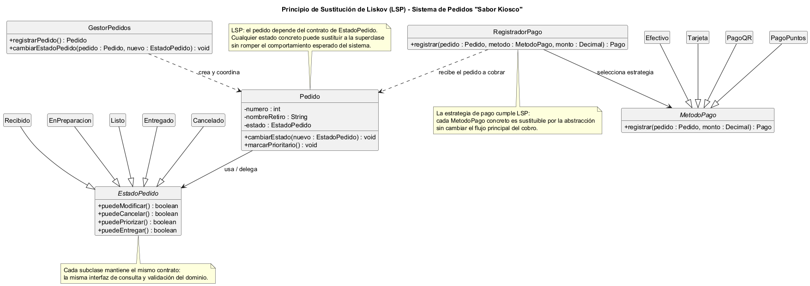

# Principio de Sustitución de Liskov (LSP)

## Propósito y Tipo del Principio SOLID

El Principio de Sustitución de Liskov (Liskov Substitution Principle, LSP) establece que los objetos de una superclase deben poder ser reemplazados por objetos de una subclase sin alterar el comportamiento correcto del sistema. En otras palabras, una jerarquía de herencia solo es válida si cada subclase preserva el contrato de la clase base.

En el contexto del kiosco gastronómico, este principio es clave para modelar correctamente el ciclo de vida del pedido y cualquier otra familia de comportamientos que evolucione a lo largo del tiempo. Si una subclase modifica las reglas esperadas de forma más restrictiva o más permisiva de lo que la superclase define, el sistema deja de ser verificable y la lógica de negocio puede romperse sin que el código presente errores de compilación.

Desde la perspectiva del diseño orientado a objetos, LSP ayuda a detectar jerarquías artificiales. No basta con que exista una relación de herencia sintáctica; debe existir una relación semántica de sustitución real. En el sistema, esto implica que los estados del pedido, los métodos de pago y otros comportamientos posibles deben respetar el mismo contrato, aunque con variaciones específicas.

## Motivación

El problema del diseño sin LSP aparece cuando una jerarquía se construye solo para reutilizar código o para “parecer” ordenada, pero no cumple con la expectativa de comportamiento. Un ejemplo clásico es un diseño en el que una clase `PedidoListo` o `PedidoCancelado` heredara de `Pedido` y se comportara como si fuera un pedido normal, permitiendo editar productos, modificar el nombre de retiro o volver a cambiar de estado. Eso contradice la regla del negocio: el pedido listo no puede seguir siendo modificado, y un pedido cancelado no puede volver a un estado activo.

Otro problema frecuente es crear una herencia de `PersonalAtencion` y `Cocina` como si fueran “tipos de empleado” sin definir un contrato común. Eso puede parecer lógico en un esquema superficial, pero no refleja el dominio: una cocina no es sustituta de un personal de atención en el mismo protocolo, ni viceversa. El diseño correcto no es una jerarquía artificial, sino una separación clara de responsabilidades con contratos bien definidos.

Las consecuencias de una jerarquía incorrecta son graves:

- El sistema acepta operaciones inválidas y rompe la integridad del pedido.
- Se introducen condiciones dispersas para corregir problemas de herencia.
- La validación de estados y pagos queda escondida en llamadas condicionales, y el código se vuelve frágil.
- Se dificulta la extensión del negocio con nuevos medios de pago, nuevos estados o nuevas políticas sin romper el comportamiento actual.

### Ejemplos del mundo real que explican la necesidad de LSP

1. Rectángulo y cuadrado
   Un `Cuadrado` es un caso particular de `Rectangulo`, pero si la superclase define `setAncho()` y `setAlto()`, el cuadrado puede violar el invariante de que todos los lados deben ser iguales. La subclase no puede sustituir a la base sin romper el comportamiento esperado.

2. Vehículos y motos con licencia especial
   Si la clase base `Vehiculo` permite conducir en cualquier carretera y la subclase `MotoDeCarrera` exige restricciones adicionales o cambia la semántica de arranque, la sustitución deja de ser segura. La subclase debe respetar el mismo contrato de uso general.

3. Cuentas bancarias y tipos especiales
   Una `CuentaCorriente` puede ser una variante de `Cuenta`, pero no puede redefinir el comportamiento de `depositar()` o `retirar()` de tal modo que rompa la regla de saldo mínimo o la operación de consulta. La subclase debe conservar el mismo comportamiento observable del contrato base.

### Ejemplo del proyecto

En el kiosco, el caso concreto es más claro: los estados del pedido no son “clases de pedido”, sino variantes de un contrato común de estado con reglas específicas. LSP exige que cada variante sea totalmente sustituible por el contrato base en la lógica del dominio. Este es el ejemplo del proyecto y la aplicación concreta del principio.

## Explicación de Herencia

La herencia es una relación entre clases en la que una subclase especializa una superclase. En programación orientada a objetos, la clase hija hereda atributos y comportamientos de la clase base y puede redefinir o complementar su comportamiento. Sin embargo, la simple existencia de la relación de herencia no garantiza que el diseño sea correcto.

Para cumplir con LSP, la herencia debe representar una relación de “es un” semánticamente válida: si un cliente usa una instancia de la superclase, debe poder usar una instancia de la subclase sin percibir cambios en el comportamiento esperado.

Aplicado al sistema de pedidos:

- `EstadoPedido` es la abstracción que representa el contrato común para cualquier estado del pedido.
- `Recibido`, `EnPreparacion`, `Listo`, `Entregado` y `Cancelado` son subclases con reglas distintas de validación.
- `Pedido` no hereda de un estado; en cambio, usa un estado. Esto es correcto, porque un pedido tiene un estado, pero el estado no es un tipo de pedido.
- `MetodoPago` representa una estrategia común para registrar un cobro; cada variante concreta la implementa con el mismo contrato de uso.

Una jerarquía inválida sería, por ejemplo, que `PedidoCancelado` heredara de `Pedido` y permitiera cambiar de estado o agregar productos. Eso rompe el contrato del pedido, porque la clase hija no puede ser sustituida por la clase base sin producir un resultado que contravenga la lógica del negocio.

La idea correcta es definir jerarquías con contrato cohesivo y reglas invariantes, no con relaciones de conveniencia. En el dominio del kiosco, la sustitución segura surge cuando el cliente solo conoce la abstracción, no el detalle real del estado o del medio de pago.

## Estructura de Clases

El siguiente diagrama muestra una jerarquía compatible con LSP: cada subtipo de `EstadoPedido` mantiene el mismo contrato observable del estado del pedido y puede ser reemplazado por la superclase sin alterar el comportamiento del sistema. También se muestra la estrategia de pago, que cumple el mismo principio de sustitución.

- [Ver el diagrama en detalle (PNG)](../../diagramas/01-diagrama-clases/01-solid-03-lsp.png)
- [Ver el código PlantUML](../../diagramas/01-diagrama-clases/01-solid-03-lsp.puml)

## Justificación Técnica

Lo que se observa en el diagrama es una arquitectura de contratos y especializaciones coherentes con la lógica del negocio. El punto central es que `Pedido` depende de una abstracción, `EstadoPedido`, y no de un estado concreto. Esto permite que el flujo del sistema diga: “si el pedido puede modificar, cancelar, priorizar o entregar, determina el comportamiento en función del estado actual”.

Cada subclase de `EstadoPedido` cumple la misma interfaz pública:

- `puedeModificar()`
- `puedeCancelar()`
- `puedePriorizar()`
- `puedeEntregar()`

Los valores devueltos pueden diferir por estado, pero el contrato no cambia. Por ejemplo:

- `Recibido` permite modificar y cancelar.
- `EnPreparacion` bloquea la modificación, pero sigue permitiendo cancelar y priorizar.
- `Listo` permite entrega, pero no modificación.
- `Entregado` y `Cancelado` son de consulta histórica y no deberían permitir nuevas transiciones de negocio.

Esto es una aplicación correcta de LSP porque el cliente que usa `EstadoPedido` no necesita saber qué estado concreto hay detrás; solo necesita que el objeto responda a las operaciones del contrato de forma consistente con el dominio.

La misma regla aplica a la jerarquía `MetodoPago`:

- Cada clase concreta (`Efectivo`, `Tarjeta`, `PagoQR`, `PagoPuntos`) implementa la misma operación `registrar(...)`.
- El cliente `RegistradorPago` puede trabajar con cualquiera de ellas sin tener que cambiar su lógica de coordinación.
- Si una variante exigiera reglas diferentes que contradigan el contrato base, la sustitución ya no sería segura.

También resulta importante destacar qué no debe heredarse. En este sistema, `Cocina` no es una subclase de `Pedido` ni de `PersonalAtencion`; es un actor del dominio con responsabilidades distintas. Del mismo modo, un estado del pedido no es un tipo de pedido, sino un comportamiento asociado. Esto evita jerarquías ambiguas que podrían romper el principio.

Desde el punto de vista técnico, la solución propuesta es correcta porque:

1. Preserva el contrato de la superclase en todas las subclases.
2. No introduce operaciones contradictorias ni invariantes ocultos.
3. Permite extender el sistema sin modificar el código central de `Pedido` o `RegistradorPago`.
4. Mantiene la lógica de negocio encapsulada en el estado o la estrategia, y no dispersa en `if/else`.
5. Reduce el acoplamiento y mejora la mantenibilidad y la extensibilidad del dominio.

En resumen, LSP describe la idea de que una jerarquía es válida cuando las subclases pueden reemplazar a la superclase sin romper el comportamiento esperado. En el sistema de pedidos, esa condición se cumple con la jerarquía de estados del pedido y con la familia de métodos de pago, siempre que se mantenga la coherencia del contrato y se evite la herencia artificial.
