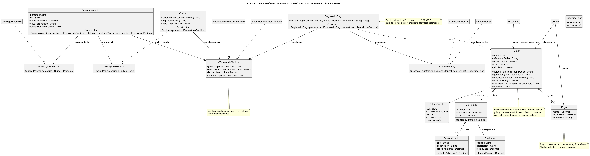

# Anexo 05: Principio de Inversión de Dependencias (DIP)

## Propósito y Tipo del Principio SOLID
El Principio de Inversión de Dependencias (DIP) es un principio de **diseño estructural y arquitectónico**. Su propósito principal es desacoplar los módulos de alto nivel (la lógica de negocio o de dominio) de los módulos de bajo nivel (los detalles de implementación, como persistencia o pasarelas de pago). 

DIP establece dos reglas fundamentales:
1. Los módulos de alto nivel no deben depender de módulos de bajo nivel; ambos deben depender de abstracciones.
2. Las abstracciones no deben depender de los detalles; los detalles deben depender de las abstracciones.

## Motivación
En el diseño inicial, `PersonalAtencion` envía el pedido directamente a `Cocina`, y `Cocina` depende de `PersonalAtencion` para recibirlo: dos roles de alto nivel quedan acoplados entre sí. Las tarjetas CRC identifican estas colaboraciones concretas:

| Clase | Colaboradores concretos indicados por las CRC | Evaluación DIP |
|---|---|---|
| `PersonalAtencion` | `Pedido`, `Producto`, `Personalizacion`, `Cocina` | Los primeros tres son conceptos del dominio. La interacción directa con `Cocina` acopla el envío del pedido a una forma particular de recepción. El diseño tampoco expresa contratos para consultar el catálogo o guardar pedidos. |
| `Cocina` | `Pedido`, `PersonalAtencion`, `ItemPedido`, `Producto` | `Pedido`, `ItemPedido` y `Producto` son datos y reglas del dominio que cocina necesita interpretar. Depender de `PersonalAtencion` para recibir pedidos une dos roles que pueden comunicarse mediante un contrato. |
| `Pedido` | `ItemPedido`, `Personalizacion`, `PersonalAtencion`, `Cocina`, `Encargado`, `Pago`, `Cliente` | `ItemPedido`, `Personalizacion` y `Pago` son colaboradores del dominio. Las referencias a roles (`PersonalAtencion`, `Cocina`, `Encargado` y `Cliente`) no deberían ser necesarias para que `Pedido` aplique sus propias reglas y transiciones. |
| `Pago` | `Pedido`, `Cliente` | `Pedido` es la entidad cuyo total se valida; esta relación pertenece al dominio. El tipo concreto del procesador de cobro no aparece en la CRC ni debe incorporarse a `Pago`. |

El boceto no incluye persistencia ni proveedores concretos de cobro. Si esos detalles se agregaran como clases concretas, la lógica del kiosco quedaría atada a una tecnología específica, no se podría probar de forma aislada y habría que modificarla ante cada cambio de infraestructura. Por eso se proponen como puntos de extensión, en lugar de atribuirlos retrospectivamente a las tarjetas.

Aplicar DIP no significa crear interfaces para todas las clases: `Pedido`, `ItemPedido`, `Producto`, `Personalizacion` y `Pago` son conceptos del dominio y sus colaboraciones entre sí no necesitan ocultarse tras interfaces. Al aplicar DIP, introducimos interfaces que actúan como contratos neutros, invirtiendo la dirección de la dependencia para garantizar un sistema extensible y mantenible.

## Explicación de Clases Abstractas e Interfaces
- **Interfaces:** Definen un contrato puro de comportamiento sin implementación ni estado propio. Se utilizaron para definir la persistencia (`IRepositorioPedidos`), el catálogo (`ICatalogoProductos`), la recepción de comandas (`IRecepcionPedidos`) y la pasarela de pagos (`IProcesadorPago`), asegurando un desacoplamiento total.
- **Clases Abstractas:** Se emplean cuando existe código compartido o un estado común entre varias clases derivadas dentro de una misma jerarquía de herencia.

## Estructura de Clases
El diseño refactorizado introduce interfaces estratégicas para desacoplar las responsabilidades de infraestructura y servicios:

1. **`IRecepcionPedidos`:** Define el contrato para la recepción de comandas. `Cocina` implementa este contrato, permitiendo que en el futuro se sustituya por una pantalla o impresora sin modificar `PersonalAtencion`.
2. **`ICatalogoProductos`:** Permite consultar los datos de productos disponibles sin acoplar la atención al cliente a una tecnología específica de catálogo.
3. **`IRepositorioPedidos`:** Abstrae las operaciones de persistencia (guardar, buscar, listar, actualizar) de los pedidos. Puede ser implementado por repositorios en memoria, bases de datos SQL o NoSQL.
4. **`IProcesadorPago`:** Contrato que aísla la lógica externa del cobro (`ProcesadorEfectivo`, `ProcesadorQR`), impidiendo que las entidades de dominio dependan de pasarelas de pago.

### Diagrama de clases

- [Ver el diagrama en detalle (PNG)](../../diagramas/01-diagrama-clases/01-solid-05-dip.png)
- [Ver el código PlantUML](../../diagramas/01-diagrama-clases/01-solid-05-dip.puml)

## Justificación Técnica
Las implementaciones concretas se seleccionan en el punto de composición de la aplicación y se entregan a los coordinadores al crearlos, mediante Inyección de Dependencias por constructor:

| Receptor | Contratos recibidos por constructor | Motivo |
|---|---|---|
| `PersonalAtencion` | `IRepositorioPedidos`, `ICatalogoProductos`, `IRecepcionPedidos` | Registrar y modificar pedidos, consultar productos y enviarlos a cocina sin depender de implementaciones concretas. |
| `Cocina` | `IRepositorioPedidos` | Consultar pedidos pendientes y actualizar su estado sin conocer el mecanismo de almacenamiento. |
| `RegistradorPago` | `IProcesadorPago`, `IRepositorioPedidos` | Procesar el cobro y persistir el registro sin acoplar el flujo a un proveedor ni a una base de datos. |

No se inyectan repositorios ni procesadores externos dentro de `Pedido` o `Pago`: sus responsabilidades CRC describen entidades de dominio, no servicios de infraestructura.

La aplicación de DIP con esta inyección garantiza que:
- Los coordinadores del kiosco (`PersonalAtencion`, `Cocina`, `RegistradorPago`) dependan de contratos abstractos y no de implementaciones concretas, mientras que `Pedido` y `Pago` conservan sus reglas sin conocer la infraestructura.
- Se puedan realizar pruebas unitarias utilizando dobles de prueba (*mocks/stubs*) sin necesidad de una base de datos ni una pasarela de pago real.
- El sistema sea extensible (RNF8) y cumpla con el principio OCP (Open/Closed), permitiendo sustituir el almacenamiento, el catálogo, el canal de recepción en cocina o el procesador de pago sin alterar el código existente.
- Las reglas queden protegidas (RNF7): las entidades siguen siendo responsables de validar sus operaciones, y la inversión de dependencias no habilita a las capas externas a cambiar directamente su estado.
